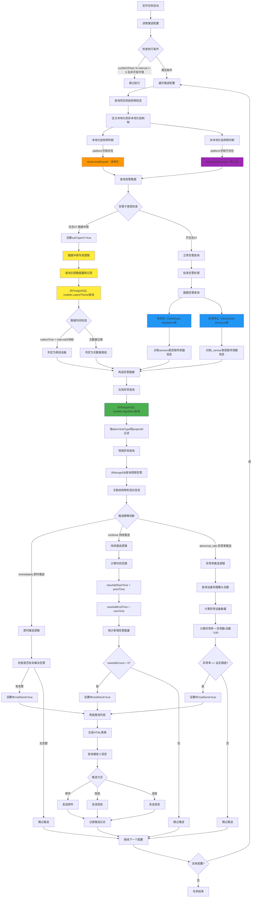

```mermaid
flowchart TD
    A[定时任务启动] --> B[读取推送配置]
    B --> C{检查执行条件}
    C -->|curMinOfYear % interval != 0 且非开发环境| Z[跳过执行]
    C -->|满足条件| D[遍历推送配置]
    
    D --> E[查询项目和结构物信息]
    E --> F[区分本地化和非本地化结构物]
    
    F --> G[本地化结构物判断]
    F --> H[非本地化结构物判断]
    
    G -->|platform字段存在| G1[strucLocalId.push - 本地化]
    H -->|platform字段不存在| H1[strucAnxinId.push - 安心云]
    
    G1 --> I[查询告警数据]
    H1 --> I
    
    I --> J{告警子类型检查}
    J -->|包含47-数据中断| K[设置subType47=true]
    J -->|不包含47| L[正常告警查询]
    
    K --> M[数据中断专用逻辑]
    L --> N[标准告警处理]
    
    M --> M1[查询主题数据最新记录]
    M1 --> M2[从PostgreSQL models.LatestTheme查询]
    M2 --> M3{数据时间检查}
    M3 -->|collectTime < interval分钟前| M4[判定为离线设备]
    M3 -->|无数据记录| M5[判定为无数据离线]
    M4 --> O[构造告警数据]
    M5 --> O
    
    N --> N1[数据告警查询]
    N1 --> N2[本地化: ClickHouse dataAlarm库]
    N1 --> N3[非本地化: ClickHouse anxinyun库]
    N2 --> N4[关联sensors表获取传感器信息]
    N3 --> N5[关联t_sensor表获取传感器信息]
    N4 --> O
    N5 --> O
    
    O --> P[应用异常查询]
    P --> P1[从PostgreSQL models.AppAlarm查询]
    P1 --> P2[按alarmSubType和projectId过滤]
    
    P2 --> Q[视频异常查询]
    Q --> Q1[从MongoDB查询视频告警]
    Q1 --> Q2[关联结构物和测点信息]
    
    Q2 --> R{推送策略判断}
    R -->|immediately 即时推送| S[即时推送逻辑]
    R -->|continue 持续推送| T[持续推送逻辑]
    R -->|abnormal_rate 异常率推送| U[异常率推送逻辑]
    
    S --> S1[检查是否有未解决告警]
    S1 -->|有告警| S2[设置ifEmailSend=true]
    S1 -->|无告警| S3[跳过推送]
    
    T --> T1[计算时间范围]
    T1 --> T2[newAddStartTime = pointTime]
    T2 --> T3[newAddEndTime = nowTime]
    T3 --> T4[统计新增告警数量]
    T4 --> T5{newAddCount > 0?}
    T5 -->|是| T6[设置ifEmailSend=true]
    T5 -->|否| T7[跳过推送]
    
    U --> U1[查询设备和摄像头总数]
    U1 --> U2[计算异常设备数量]
    U2 --> U3[计算异常率 = 异常数/总数*100]
    U3 --> U4{异常率 >= 设定阈值?}
    U4 -->|是| U5[设置ifEmailSend=true]
    U4 -->|否| U6[跳过推送]
    
    S2 --> V[构造推送内容]
    T6 --> V
    U5 --> V
    
    V --> W[生成HTML表格]
    W --> X[查询接收人信息]
    X --> Y{推送方式}
    Y -->|邮件| Y1[发送邮件]
    Y -->|短信| Y2[发送短信]
    Y -->|语音| Y3[发送语音]
    
    Y1 --> AA[记录推送日志]
    Y2 --> AA
    Y3 --> AA
    
    S3 --> BB[继续下一个配置]
    T7 --> BB
    U6 --> BB
    AA --> BB
    
    BB --> CC{还有配置?}
    CC -->|是| D
    CC -->|否| DD[任务结束]
    
    style M fill:#ffeb3b
    style M1 fill:#ffeb3b
    style M2 fill:#ffeb3b
    style P1 fill:#4caf50
    style N2 fill:#2196f3
    style N3 fill:#2196f3
    style G1 fill:#ff9800
    style H1 fill:#9c27b0
```